# IMDb Review Analytics Platform on AWS

An end-to-end cloud-native data engineering project demonstrating batch and real-time data processing on AWS using the IMDb Reviews dataset.

The platform ingests raw JSON data into Amazon S3, transforms it into partitioned Apache Parquet datasets with AWS Glue and PySpark, performs distributed analytics using Apache Spark on Amazon EMR, and processes streaming events with AWS Lambda, Amazon Kinesis, and Managed Apache Flink.

---

## 🚀 TL;DR

Built an end-to-end cloud-native data engineering platform on AWS that ingests, transforms, analyzes, and processes the IMDb Reviews dataset using both batch and real-time pipelines.

- **Dataset:** IMDb Reviews (JSON, 5.5M+ reviews)
- **Architecture:** Batch ETL + Batch Analytics + Real-Time Streaming
- **Cloud Platform:** Amazon Web Services (AWS)
- **Languages:** Python, PySpark, SQL
- **Core Services:** Amazon S3, AWS Glue, Amazon Athena, Amazon EMR, AWS Lambda, Amazon Kinesis, Managed Apache Flink
- **Outputs:**
  - Partitioned Apache Parquet datasets
  - SQL analytics with Amazon Athena
  - Distributed movie ranking generation with Apache Spark on Amazon EMR
  - Near real-time suspicious review detection using Amazon Kinesis and Managed Apache Flink
 
---

## 📂 Table of Contents

- [🚀 TL;DR](#-tldr)
- [📚 Dataset](#-dataset)
- [📂 Key Features](#-key-features)
- [📂 Architecture](#-architecture)
  - [📌 Batch ETL Pipeline](#-batch-etl-pipeline)
  - [📌 Batch Analytics Pipeline](#-batch-analytics-pipeline)
  - [📌 Real-Time Streaming Pipeline](#-real-time-streaming-pipeline)
- [📂 Technologies](#-technologies)
- [📂 Lessons Learned](#-lessons-learned)
- [📂 Future Improvements](#-future-improvements)

---

## 📂 Dataset

This project uses the **IMDb Review Dataset - ebD**, a publicly available dataset hosted on Kaggle.

The dataset contains over **5.5 million** movie and TV show reviews, including ratings, review text, spoiler information, reviewer metadata, and review helpfulness vote.

Its size and structure make it well suited for demonstrating scalable ETL pipelines, distributed analytics, and real-time stream processing on AWS.

**Source:** https://www.kaggle.com/datasets/ebiswas/imdb-review-dataset

---

## 📂 Key Features

This project demonstrates how multiple AWS services can be combined to build a scalable cloud-native data platform supporting both batch analytics and real-time stream processing.

- End-to-end cloud-native data engineering platform
- Batch ETL pipeline using AWS Glue and PySpark
- Transformation of raw JSON data into partitioned Apache Parquet datasets
- Metadata management with AWS Glue Data Catalog
- Interactive SQL analytics using Amazon Athena
- Distributed Spark processing on Amazon EMR
- Event-driven data ingestion with AWS Lambda
- Real-time stream processing using Amazon Kinesis and Managed Apache Flink

---

## 📂 Architecture

The platform is organized into three complementary pipelines, each addressing a different stage of the data engineering lifecycle while operating on the same IMDb Reviews dataset.

- **Batch ETL Pipeline** ingests raw JSON data, transforms it into partitioned Apache Parquet files, and registers the resulting dataset for SQL analytics.
- **Batch Analytics Pipeline** executes distributed Apache Spark workloads on Amazon EMR to perform large-scale analytical processing.
- **Real-Time Streaming Pipeline** demonstrates event-driven processing by streaming review events through Amazon Kinesis and detecting suspicious activity in near real time.

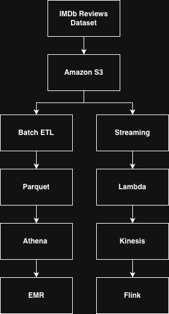

---

### 📌 Batch ETL Pipeline

Transforms raw IMDb review data into partitioned Apache Parquet datasets optimized for large-scale analytical workloads.

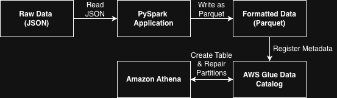

> **Goal**
>
> Convert raw IMDb review data stored in Amazon S3 into an optimized, partitioned Apache Parquet dataset that can be queried efficiently using Amazon Athena.

---

### Workflow

1. Raw IMDb review data is stored in an Amazon S3 landing zone.
2. An AWS Glue ETL job executes a PySpark application.
3. The dataset is cleaned, transformed, and partitioned by review year and month.
4. The transformed dataset is written back to Amazon S3 in Apache Parquet format.
5. Metadata is registered in the AWS Glue Data Catalog.
6. Amazon Athena queries the dataset directly from Amazon S3 using SQL.

---

### Why this design?

| Component | Purpose |
|-----------|---------|
| Amazon S3 | Durable and scalable storage for raw and processed datasets |
| AWS Glue | Serverless ETL service built on Apache Spark |
| Apache Parquet | Columnar storage format optimized for analytical workloads |
| AWS Glue Data Catalog | Centralized metadata repository for datasets |
| Amazon Athena | Serverless SQL query engine for data stored in Amazon S3 |

---

### Benefits

- ✅ Fully serverless ETL workflow
- ✅ Optimized storage through Apache Parquet
- ✅ Faster analytical queries
- ✅ Partition pruning for improved query performance
- ✅ Scalable cloud-native architecture

---

### Screenshots

#### Raw Dataset in Amazon S3 (Landing Zone)

The original IMDb Reviews dataset is stored in an Amazon S3 landing zone as raw JSON files. This bucket serves as the ingestion layer for the ETL pipeline.

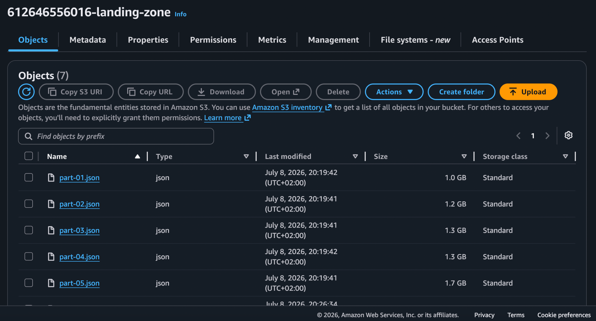

---

#### AWS Glue ETL Job

The AWS Glue job successfully converts the raw IMDb JSON dataset into partitioned Apache Parquet files.

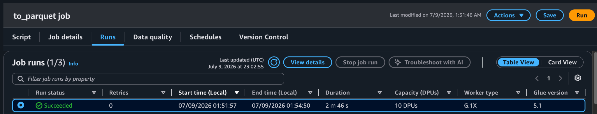

---

#### Partitioned Dataset

The transformed dataset is partitioned by review year and month to improve query performance in Amazon Athena.

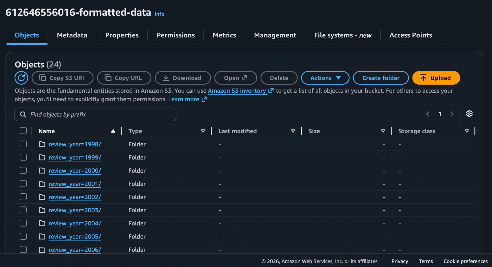
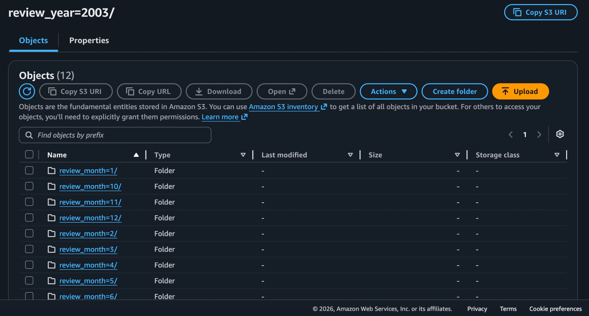

---

#### Athena Query Results

Amazon Athena queries the partitioned dataset directly from Amazon S3 without requiring a traditional database.

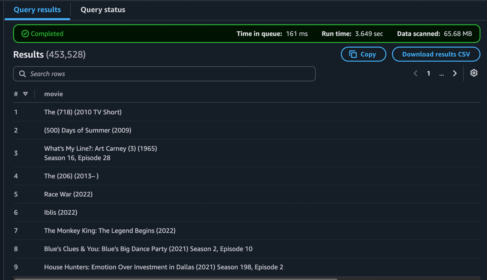

---

### 📌 Batch Analytics Pipeline

Performs distributed analytics on the partitioned IMDb dataset using Apache Spark running on Amazon EMR to generate large-scale ranking results.

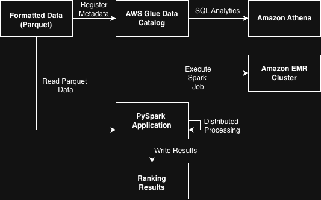

> **Goal**
>
> Execute distributed Apache Spark jobs on Amazon EMR to analyze the transformed IMDb dataset and generate ranking results at scale.

---

### Workflow

1. The partitioned Parquet dataset is read from Amazon S3.
2. An Apache Spark application is submitted to an Amazon EMR cluster.
3. The workload is distributed across the cluster for parallel processing.
4. Ranking results are computed from the review dataset.
5. The output is written back to Amazon S3.

---

### Why this design?

| Component | Purpose |
|-----------|---------|
| Amazon S3 | Stores the transformed Parquet dataset and analysis results |
| Apache Spark | Performs large-scale distributed data processing |
| Amazon EMR | Managed cluster for executing Spark workloads |
| Apache Parquet | Columnar storage format enabling efficient distributed processing |

---

### Benefits

- ✅ Distributed processing of large datasets
- ✅ Horizontally scalable Spark workloads
- ✅ Managed cluster infrastructure
- ✅ Optimized analytical performance using Apache Parquet
- ✅ Clear separation between ETL and analytical workloads

---

### Screenshots

#### Amazon EMR Cluster

The Amazon EMR cluster provides the managed infrastructure used to execute distributed Apache Spark workloads.

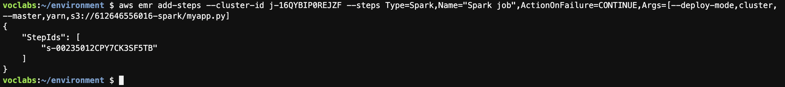
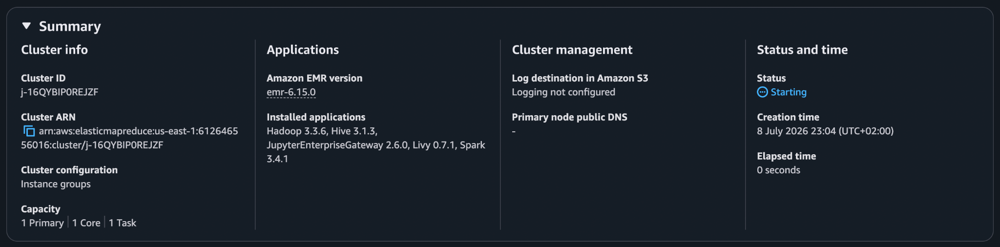

---

#### Ranking Results in Amazon S3

The generated ranking results are written back to Amazon S3, making them available for downstream analytics.

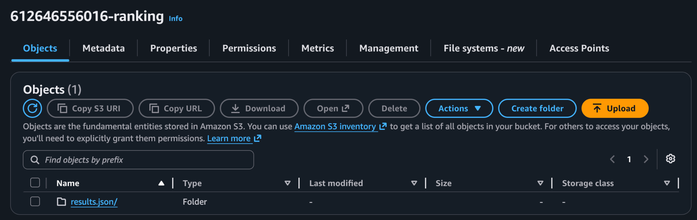
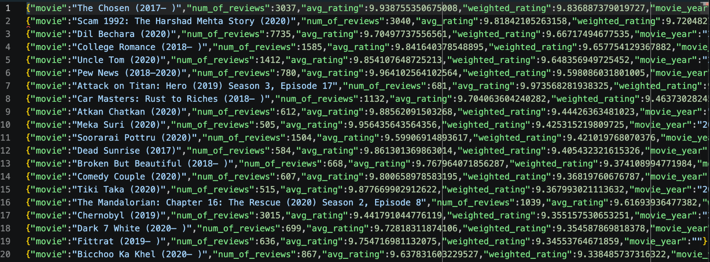

---

### 📌 Real-Time Streaming Pipeline

Demonstrates a serverless event-driven architecture for continuously processing IMDb review events and detecting suspicious activity in near real time.

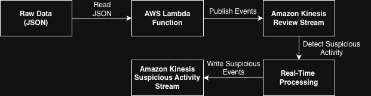

> **Goal**
>
> Demonstrate how streaming data can be processed continuously to identify suspicious review activity as events arrive.

---

### Workflow

1. Review records are read from Amazon S3.
2. AWS Lambda publishes an event for each review.
3. Events are streamed through Amazon Kinesis.
4. Managed Apache Flink continuously consumes the review stream.
5. Suspicious review activity is detected.
6. Processed events are written to an Amazon Kinesis output stream.

---

### Why this design?

| Component | Purpose |
|-----------|---------|
| Amazon S3 | Stores the source review dataset |
| AWS Lambda | Generates streaming events from the dataset |
| Amazon Kinesis | Provides scalable event streaming |
| Managed Apache Flink | Continuously processes incoming events |
| Amazon Kinesis Output Stream | Stores detected suspicious events |

---

### Benefits

- ✅ Event-driven architecture
- ✅ Near real-time event processing
- ✅ Horizontally scalable streaming platform
- ✅ Decoupled producers and consumers
- ✅ Continuous event analysis

---

### Screenshots

#### AWS Lambda Producer

The Lambda function reads review records from Amazon S3 and publishes each review as an event to the Amazon Kinesis input stream.

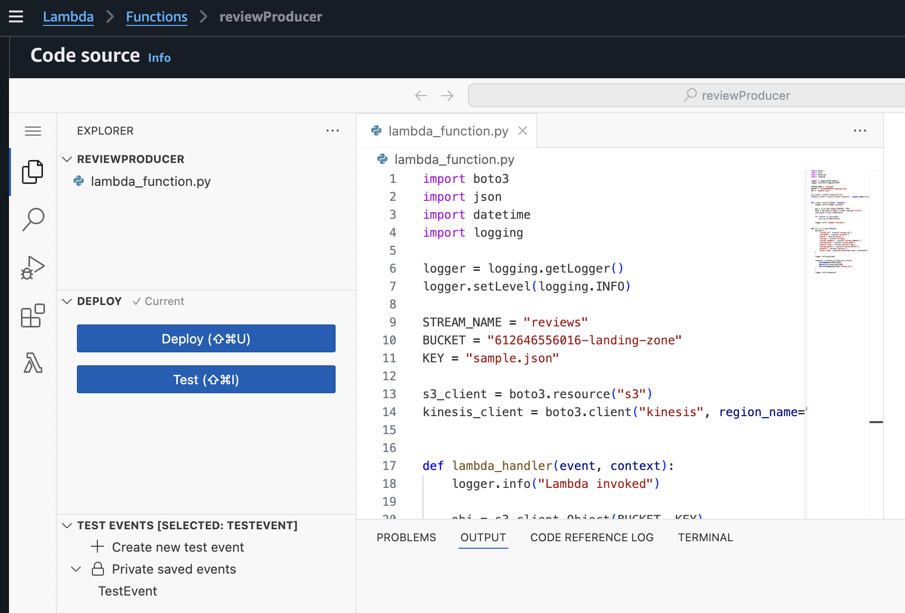

---

#### Amazon Kinesis Streams

The streaming architecture consists of an input stream receiving review events and an output stream containing detected suspicious activity.

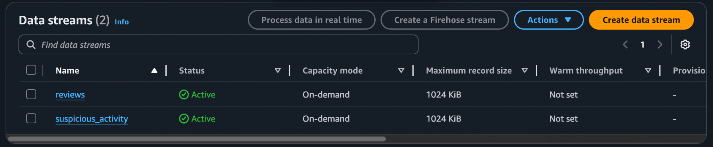

---

#### Managed Apache Flink

Managed Apache Flink continuously processes the incoming review stream using a sliding window application.

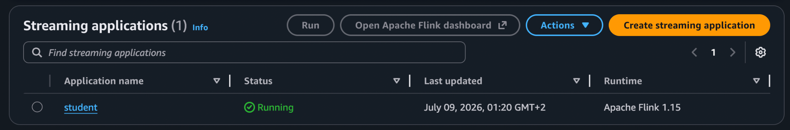

---

#### Suspicious Activity Detection

Detected suspicious review activity is written to a dedicated Amazon Kinesis output stream for downstream consumers.

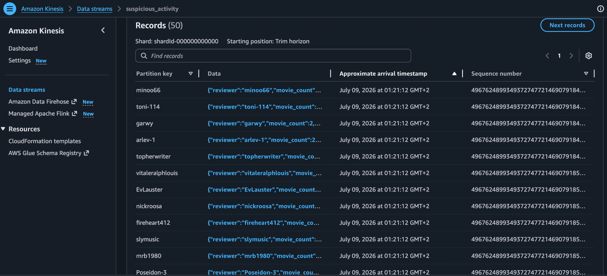

---

> **Note**
>
> Due to the resource limitations of the AWS Academy Learner Lab environment, the streaming pipeline was demonstrated using the provided `sample.json` dataset instead of the complete IMDb Reviews dataset. The architecture and processing logic remain identical and can be scaled to the full dataset without modification.

---

## 📂 Technologies

| Category | Technologies |
|----------|--------------|
| Programming | Python, PySpark, SQL |
| Cloud Platform | Amazon Web Services (AWS) |
| Storage | Amazon S3 |
| ETL | AWS Glue |
| Metadata | AWS Glue Data Catalog |
| Query Engine | Amazon Athena |
| Distributed Computing | Apache Spark, Amazon EMR |
| Streaming | Amazon Kinesis, Managed Apache Flink |
| Serverless | AWS Lambda |

---

## 📂 Lessons Learned

Through this project I gained hands-on experience with:

- Designing cloud-native batch and streaming data pipelines
- Building ETL workflows using AWS Glue and PySpark
- Transforming large JSON datasets into optimized Apache Parquet files
- Organizing partitioned datasets for efficient analytical queries
- Managing metadata using the AWS Glue Data Catalog
- Querying data lakes with Amazon Athena
- Executing distributed Apache Spark workloads on Amazon EMR
- Building event-driven architectures with AWS Lambda
- Processing streaming data using Amazon Kinesis and Managed Apache Flink
- Structuring scalable data engineering solutions on AWS

---

## 📂 Future Improvements

Potential extensions to this project include:

- Provisioning the infrastructure using Terraform
- Orchestrating pipelines with Apache Airflow or AWS Step Functions
- Implementing CI/CD pipelines with GitHub Actions
- Adding automated data quality validation using Great Expectations
- Monitoring pipelines with Amazon CloudWatch and CloudWatch Alarms
- Building analytical dashboards with Amazon QuickSight
- Managing analytical tables with Apache Iceberg
- Implementing data versioning and schema evolution
- Containerizing processing jobs with Docker
- Supporting incremental and event-driven ETL workflows
